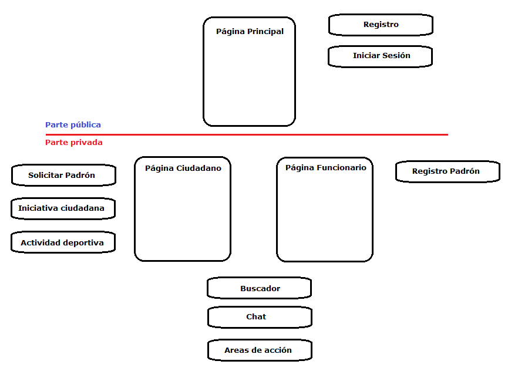
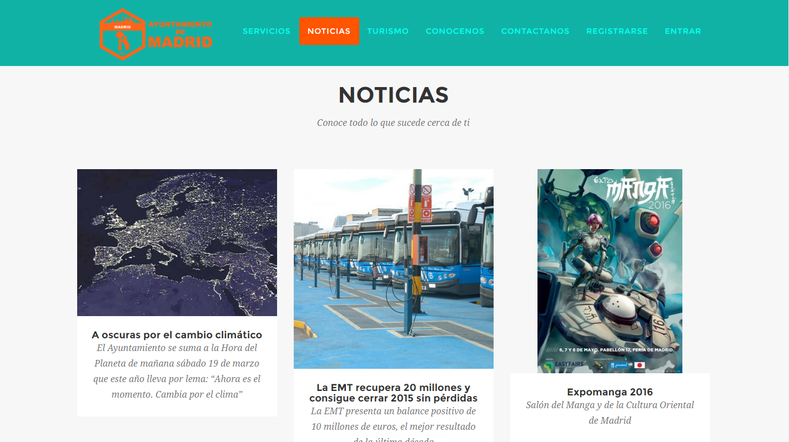
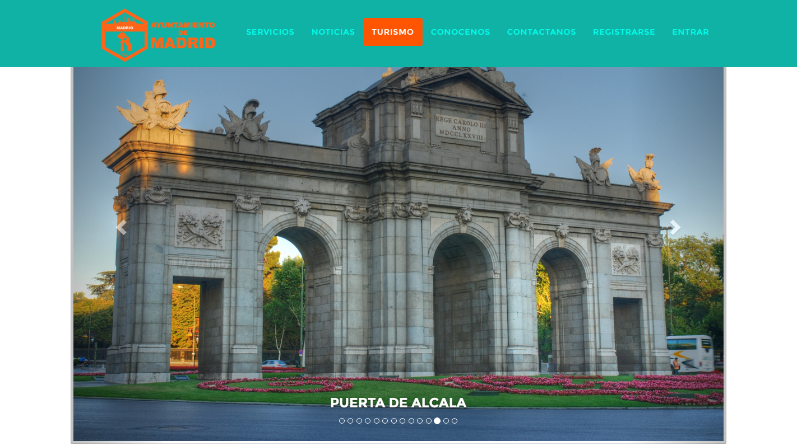
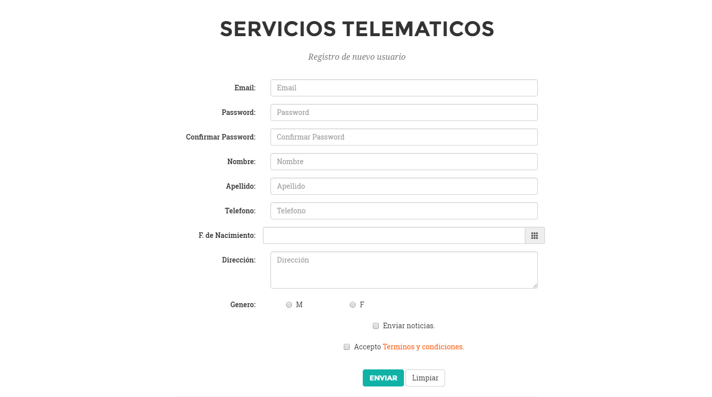
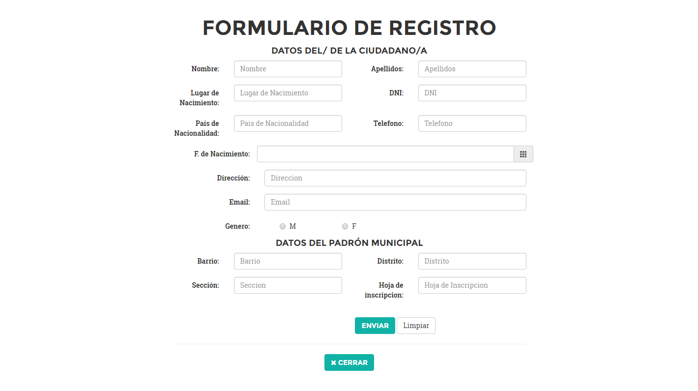
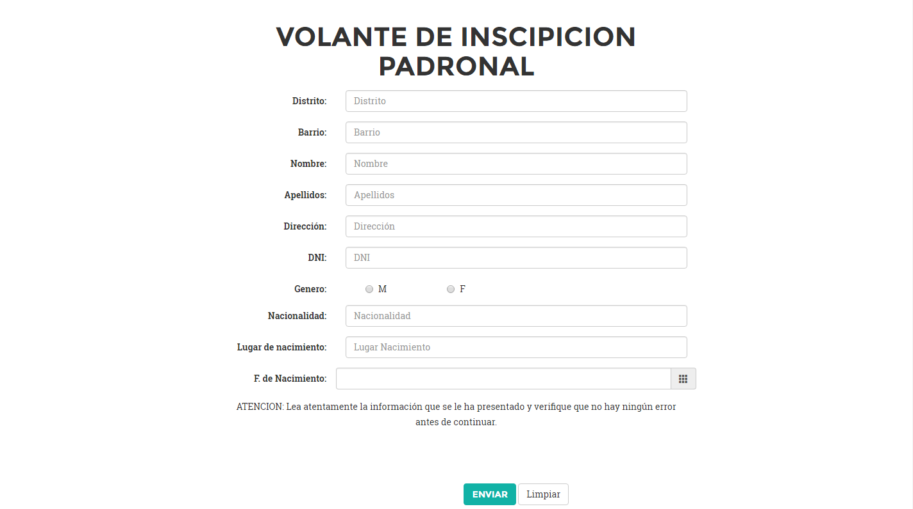
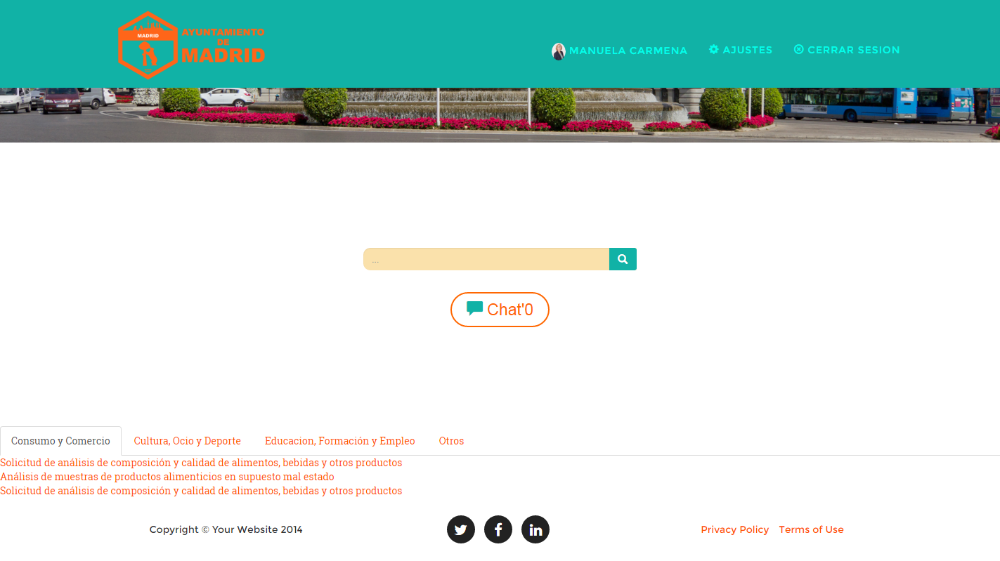
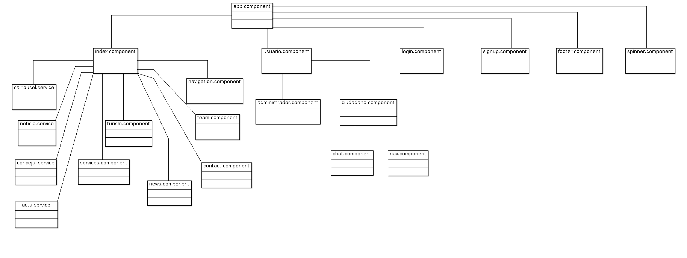

# DesarrolloAplicacionesWeb #
Práctica de la asignatura Desarrollo en Aplicaciones Web
link a Trello -> https://trello.com/b/Qfg5hD30/product-backlog

## Nombre de la Aplicacion Web ##
---------------------------------
e-ayuntamiento.es

## Temática ##
--------------
Ayuntamiento (i.e. Madrid)
*La finalidad que se persigue con esta página web es la de informar a los ciudadanos, en este caso de Madrid, de todas las gestiones que toma el ayuntamiento en las*
*distintas areas que le competen(parte pública de la aplicación), a la vez se pretende dar soporte tanto a los empleados del ayuntamiento, como a los ciudadanos para*
*poder realizar las gestiones pertinentes con el ayuntamiento(parte privada).*

## Partes de la página web ##
-----------------------------
Publica -> Principal
Privada -> Ciudadanos
	    -> Empleados
Accesibilidad

## Entidades ##
---------------
* Pleno -> tendra dos actas, orden del dia y resolucion del pleno
* Acta -> es un entidad que contendra una lista de temas a tratar o tratados y cada punto contendra su votacion y un resumen de la resolucion adoptada,en el caso de la orden del dia ambos no estaran definidos
* Ciudadano -> realizar tramites con el ayuntamiento
* Concejalia -> apartado de la pagina web que trata las distintas areas del gobierno municipal
* Alcalde -> podra ver su agenda, tener acceso al orden del dia, en definitiva realizar las funciones del alcalde telematicamente
* Concejal -> podra ver su agenda, tener acceso al orden del dia, en definitiva realizar las funciones del concejal telematicamente
* Administrativo -> tramita las peticiones de los ciudadanos

## Integrantes ##
-----------------
* Daniel de las Heras Montero d.delasherasm@alumnos.urjc.es	danydlhm
* Pablo Villalba Lucas	p.villalba@alumnos.urjc.es	pvillaul
* Félix Manuel Mellado	fm.mellado@alumnos.urjc.es	FelixManuel

## Herramientas necesarias ##
-----------------------------
Para la visualización de la página web necesitamos tener instalado en el ordenador un **navegador** (Chrome)

## Fase 2 ##
---------------
Este es un diagrama de la movilidad entre las páginas y los apartados que se han ido desarrollando

En la parte pública podemos visualizar diferentes partes como:

En la parte privada podemos visualizar direfentes partes como:

## Fase 3 ##
---------------
Este es un diagrama de clases del código TypeScript del cliente. 

